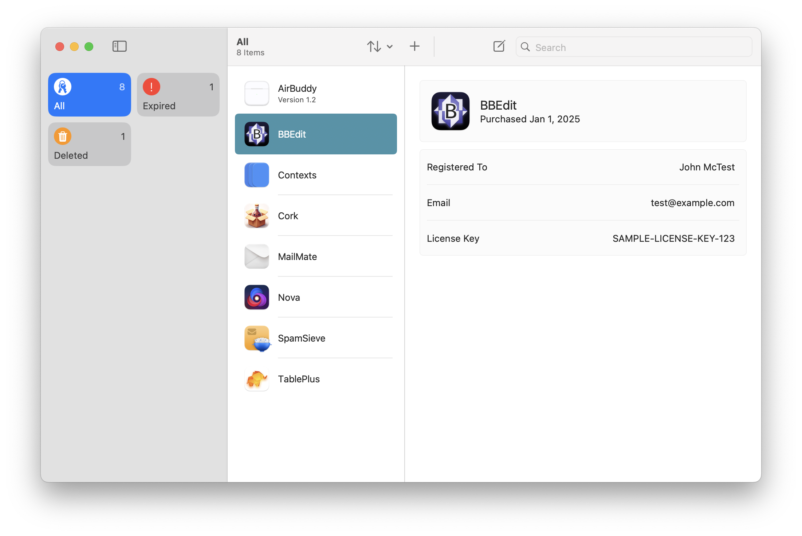

# KeyStash

A macOS utility for storing software license keys.

## Project Goals

1. Replicate the license key feature from 1Password in a fully native Mac application
2. Store user data in a standard database format (SQLite) and enable the user to easily export their data into a standard format, like CSV
3. Provide syncing capability via iCloud - and perhaps other options down the road

## Installation

### Requirements

- An Intel or Apple Silicon Mac running MacOS 14 Sonoma or later

### Homebrew

The suggested method for installing KeyStash is through Homebrew.

- Add the 'ghall89/tap' tap with brew tap `ghall89/tap`
- Install QuestLogger with `brew install --cask keystash`

Alternatively, you can [manually download](https://github.com/ghall89/KeyStash/releases) the latest release of KeyStash.

## Compile From Source

### Prerequisites

- MacOS 14+
- The Latest Version of Xcode
- An [Apple Developer Account](https://developer.apple.com)

### Instructions

1. Clone this repo with `git clone git@github.com:ghall89/Serial-Box.git`
2. Open `Serial-Box.xcodeproj` from the project directory
3. Wait for package dependencies to download
4. From the menubar, go to `Product → Archive`
5. When archive is complete, click `Distribute App` and select either `Direct Distribution` or `Custom` and follow the prompts

## Package Dependencies

- [GRDB](https://github.com/groue/GRDB.swift)
- [SwiftCloudDrive](https://github.com/drewmccormack/SwiftCloudDrive)
- [MarkdownUI](https://github.com/gonzalezreal/swift-markdown-ui)
- [AlertToast](https://github.com/elai950/AlertToast)

## License

MIT License

Copyright (c) 2024 Graham Hall

Permission is hereby granted, free of charge, to any person obtaining a copy
of this software and associated documentation files (the "Software"), to deal
in the Software without restriction, including without limitation the rights
to use, copy, modify, merge, publish, distribute, sublicense, and/or sell
copies of the Software, and to permit persons to whom the Software is
furnished to do so, subject to the following conditions:

The above copyright notice and this permission notice shall be included in all
copies or substantial portions of the Software.

THE SOFTWARE IS PROVIDED "AS IS", WITHOUT WARRANTY OF ANY KIND, EXPRESS OR
IMPLIED, INCLUDING BUT NOT LIMITED TO THE WARRANTIES OF MERCHANTABILITY,
FITNESS FOR A PARTICULAR PURPOSE AND NONINFRINGEMENT. IN NO EVENT SHALL THE
AUTHORS OR COPYRIGHT HOLDERS BE LIABLE FOR ANY CLAIM, DAMAGES OR OTHER
LIABILITY, WHETHER IN AN ACTION OF CONTRACT, TORT OR OTHERWISE, ARISING FROM,
OUT OF OR IN CONNECTION WITH THE SOFTWARE OR THE USE OR OTHER DEALINGS IN THE
SOFTWARE.
